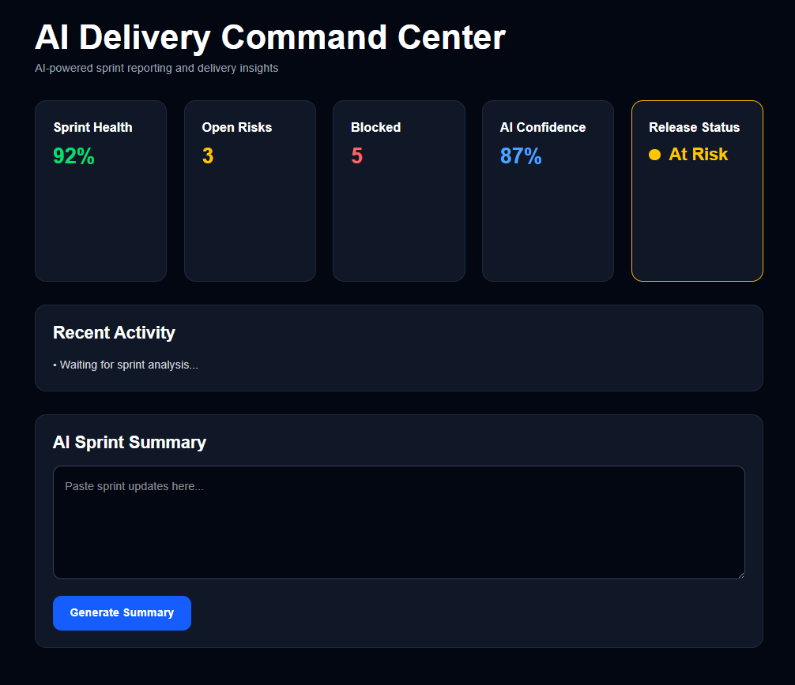
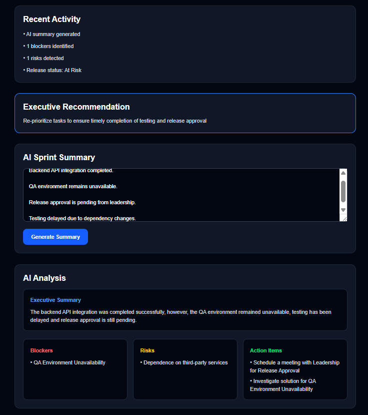
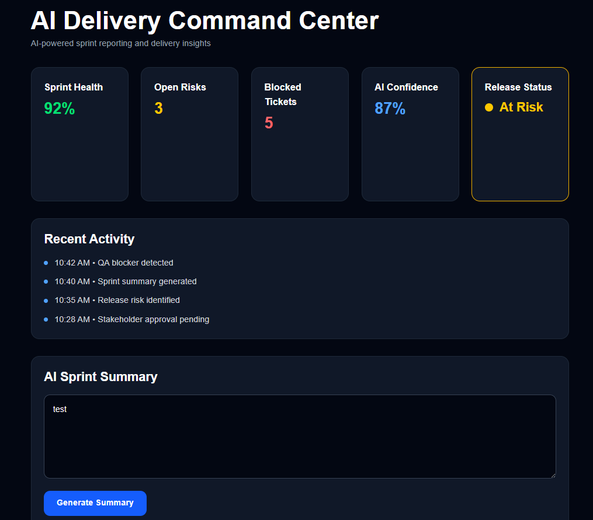
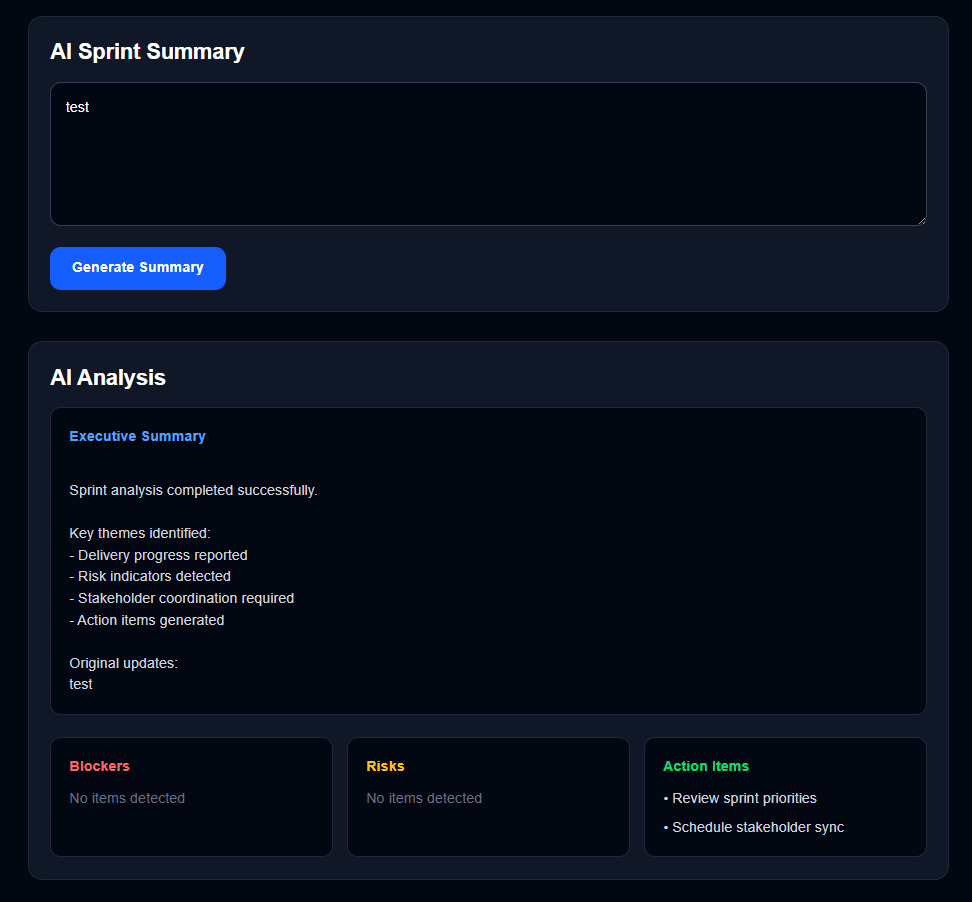

# Why This Project
This project was built to explore how AI-native operational tooling can improve engineering execution, stakeholder communication, and delivery transparency without increasing process complexity.

It also demonstrates practical applications of:

- AI workflow orchestration
- product operations automation
- LLM-powered summarization
- operational intelligence systems
- modern AI-assisted software delivery

---

# AI Delivery Command Center

AI-powered operational intelligence platform that transforms engineering workflows into actionable delivery insights, automated stakeholder communication, and sprint risk analysis.

---

# Overview

AI Delivery Command Center centralizes fragmented operational data across Jira, Slack, sprint artifacts, and meeting notes to provide real-time delivery visibility for engineering and product teams.

The platform leverages modern LLM orchestration and workflow automation to reduce manual project coordination overhead while improving cross-functional alignment and executive reporting.

---
## Screenshots

### AI Delivery Intelligence Dashboard



The dashboard provides AI-powered delivery intelligence including:

* Delivery Health Score
* Release Readiness Assessment
* AI Confidence Scoring
* Executive Recommendations
* Risk and Blocker Detection
* Dynamic Activity Feed

### Executive Delivery Insights



The platform analyzes sprint updates using a locally hosted Llama 3.2 model and generates structured executive summaries, delivery risks, blockers, action items, and release readiness recommendations.

---
# Core Features

## Sprint Intelligence
- AI-generated sprint summaries
- Delivery health analysis
- Velocity trend monitoring
- Release readiness insights

## Risk & Blocker Detection
- Automatic blocker identification
- Delivery risk prediction
- Dependency tracking
- Escalation surfacing from Slack and meeting notes

## Executive Reporting
- Stakeholder-ready status updates
- Leadership summaries
- Action item generation
- Automated release communication drafts

## Workflow Automation
- Jira ingestion and parsing
- Slack conversation summarization
- Meeting transcript analysis
- AI-powered operational recommendations

## Delivery Intelligence
- AI-generated executive summaries
- Delivery health scoring
- Release readiness assessment
- AI confidence scoring
- Executive recommendations
- Dynamic activity feed
- Automated blocker and risk detection

---

# Problem Statement

Engineering organizations often rely on fragmented workflows spread across:
- Jira
- Slack
- sprint meetings
- release documentation
- stakeholder updates

This creates:
- operational overhead
- delivery blind spots
- manual reporting fatigue
- communication delays
- cross-functional misalignment

Teams spend significant time translating raw engineering activity into actionable business insights.

---

# Solution

AI Delivery Command Center acts as an operational intelligence layer for engineering and product organizations by consolidating delivery data into AI-generated insights and workflow automation.

The system transforms operational noise into:
- concise sprint summaries
- delivery risk alerts
- executive-ready reporting
- actionable follow-up items
- release health visibility

---

# Architecture

```txt
Frontend (Next.js + Tailwind)
        ↓
FastAPI Backend Services
        ↓
AI Orchestration Layer
(Claude / OpenAI / Ollama)
        ↓
Supabase + pgvector
        ↓
External Integrations
(Jira, Slack, Meeting Notes)
```
---

# Dashboard Preview




---

# Current Status

## MVP v1 Complete

### Completed

* Next.js frontend dashboard
* FastAPI backend services
* Sprint summary generation
* Risk and blocker detection
* Action item generation
* Release status monitoring
* Activity feed
* Component-based UI architecture
* GitHub workflow with feature branching and pull requests

### In Progress

* LLM-powered executive summaries
* Delivery intelligence enhancements

### Planned

* Jira integration
* Slack integration
* Meeting transcript ingestion
* Vector search and historical delivery insights
* Delivery trend analytics
* Executive reporting automation

---

# Technology Stack

## Frontend

* Next.js
* React
* TypeScript
* Tailwind CSS

## Backend

* FastAPI
* Python

## AI Layer

* Claude (planned)
* OpenAI (planned)
* Ollama local models (planned)

## Data Layer

* Supabase (planned)
* pgvector (planned)

---

# Development Roadmap

### Phase 1 - MVP Dashboard ✅

* Dashboard UI
* Sprint analysis engine
* Risk detection
* Release monitoring

### Phase 2 - AI Intelligence 🚧

* LLM integration
* Executive summary generation
* Enhanced delivery insights

### Phase 3 - Operational Integrations

* Jira ingestion
* Slack summarization
* Meeting note analysis

### Phase 4 - Delivery Intelligence Platform

* Historical delivery analytics
* Trend forecasting
* Operational recommendations
* Executive reporting automation

