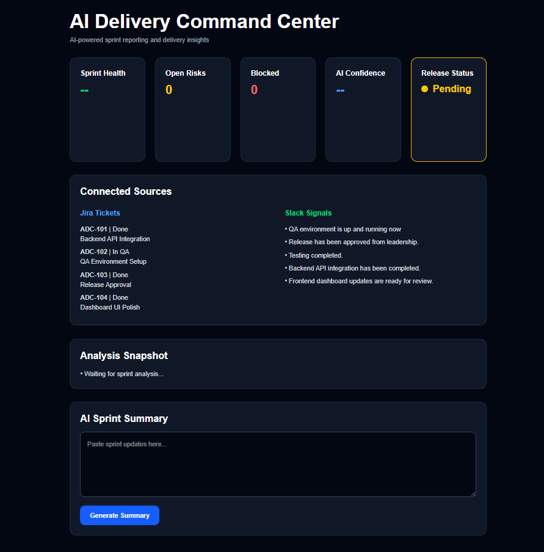
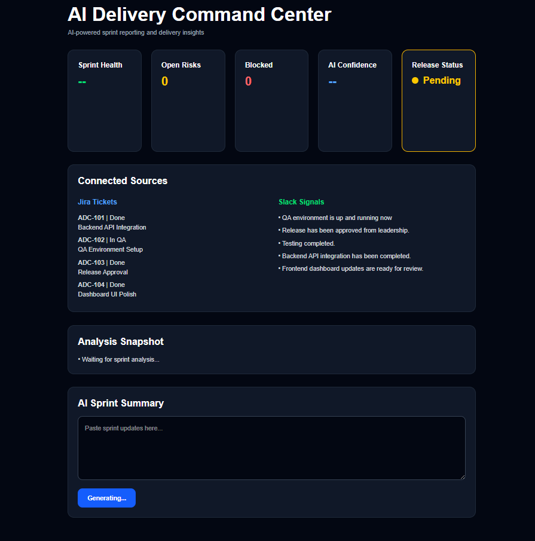
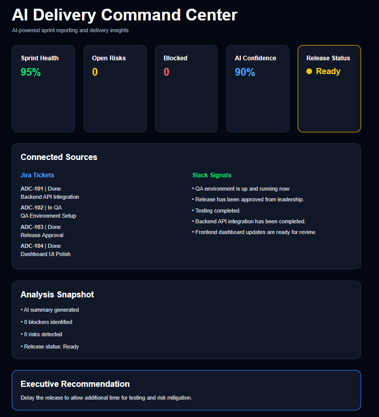
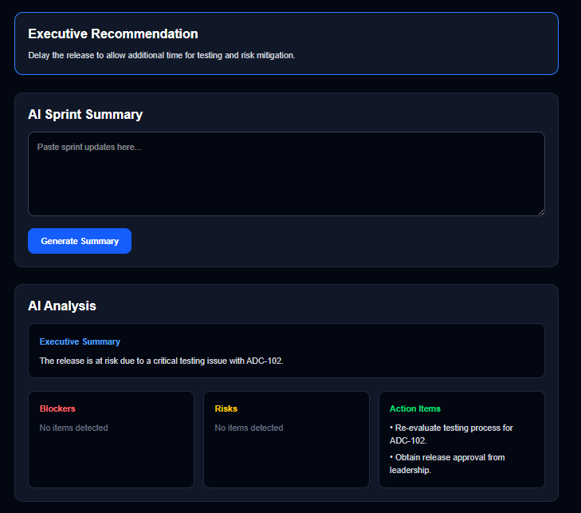
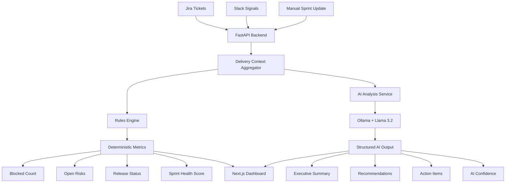

# AI Delivery Command Center

AI Delivery Command Center is an AI-assisted operational intelligence dashboard that transforms Jira delivery data, Slack signals, and sprint updates into executive ready delivery insights.

The platform combines delivery metrics with AI generated analysis to provide release readiness, delivery health, blocker visibility, risk summaries, action items, and executive recommendations.

---

## Why This Project

Engineering and product teams often operate across fragmented tools like Jira, Slack, sprint notes, and stakeholder updates. This creates manual reporting overhead, unclear delivery health, and delayed escalation of risks.

AI Delivery Command Center was built to explore how AI native tooling can improve delivery transparency without adding process complexity.

The project demonstrates practical applications of:

* AI workflow orchestration
* Delivery intelligence
* Product operations automation
* Technical program management tooling
* LLM powered executive reporting
* Source of truth driven dashboard design

---

## Demo Video

[AI Delivery Command Center Demo](https://youtu.be/KcNc55Tl8kg)

---

## Screenshots
The dashboard surfaces delivery health, release readiness, connected Jira and Slack signals, executive recommendations, and AI generated sprint analysis.

### Delivery Intelligence Dashboard

## Dashboard Overview



On load, the dashboard retrieves operational delivery data from Jira and Slack. AI analysis is generated on demand when the user submits a sprint update or clicks the "Generate Summary" CTA button. This reduces unnecessary LLM calls while keeping operational metrics are available in real time.

## Dashboard Generating



When the user clicks Generate Summary, the button updates to Generating... while the platform performs a full delivery analysis in the backend.

## Dashboard Analysis



FastAPI ingests the sprint update provided by the user, aggregates Jira delivery data and Slack delivery signals, and builds a unified delivery context. The platform combines business rules for operational metrics such as release readiness, blockers, risks, and sprint health with AI-powered analysis from Llama 3.2.

The Sprint Health and Release Status metric cards are populated based on the backend rules engine. The Open Risks and Blocked metric cards are based on the Jira data. The AI confidence score is provided by Llama 3.2. The Analysis Snapshot provides a concise summary of the latest delivery assessment, including blockers identified, risks detected, release readiness, and key outcomes from the AI analysis. 

## Dashboard Executive Summary



AI-powered analysis from Llama 3.2 generates the executive summary, recommendations, action items, and delivery insights from the combined context.

---

## Core Features

### Delivery Intelligence

* Delivery Health Score
* Release Readiness Assessment
* AI Confidence Score
* Executive Recommendations
* Dynamic Activity Feed
* Risk and Blocker Detection

### Connected Sources

* Mock Jira ticket ingestion
* Mock Slack delivery signal ingestion
* Delivery context aggregation
* Source of truth blocker detection
* Deterministic release readiness logic

### AI Analysis

* AI-generated executive summaries
* AI-generated action items
* AI-generated delivery recommendations
* Structured JSON output from Llama 3.2
* Local LLM orchestration through Ollama

---

## Architecture


```mermaid
flowchart TD
    A[Jira Tickets] --> D[FastAPI Backend]
    B[Slack Signals] --> D
    C[Manual Sprint Update] --> D

    D --> E[Delivery Context Aggregator]
    E --> F[Rules Engine]
    E --> G[AI Analysis Service]

    F --> H[Deterministic Metrics]
    H --> H1[Blocked Count]
    H --> H2[Open Risks]
    H --> H3[Release Status]
    H --> H4[Sprint Health Score]

    G --> I[Ollama + Llama 3.2]
    I --> J[Structured AI Output]
    J --> J1[Executive Summary]
    J --> J2[Recommendations]
    J --> J3[Action Items]
    J --> J4[AI Confidence]

    H --> K[Next.js Dashboard]
    J --> K
```

---

## System Design

The platform separates operational facts from AI-generated interpretation.

### Source-of-Truth Metrics

Operational metrics are calculated from structured delivery data.

* Jira owns blocker and ticket status truth
* Slack provides release and testing signals
* Backend rules calculate release readiness and delivery health

### AI-Generated Intelligence

AI is used for interpretation, summarization, and recommendations.

* Executive summary
* Delivery narrative
* Recommended actions
* AI confidence score

This design improves trust by preventing the AI from overriding source of truth delivery data.

---

## Technology Stack

### Frontend

* Next.js
* React
* TypeScript
* Tailwind CSS

### Backend

* Python
* FastAPI
* Pydantic
* Uvicorn

### AI Layer

* Ollama
* Llama 3.2
* Structured JSON prompting

### Integrations

* Mock Jira service
* Mock Slack service
* Delivery context API

---

## Current Data Flow

```txt
Jira Tickets
Slack Signals
Manual Sprint Update
        ↓
FastAPI Backend
        ↓
Delivery Context Aggregation
        ↓
Rules Engine + AI Service
        ↓
Structured Delivery Intelligence
        ↓
Next.js Dashboard
```

---

## Key Design Decision

The platform does not rely on AI for every decision.

Release readiness, blocker counts, and health scoring are calculated through deterministic backend logic using source-of-truth delivery signals.

AI is used where it adds the most value: synthesizing complex operational context into clear summaries, recommendations, and action items.

This mirrors how enterprise AI systems should be designed: reliable rules for governance, AI for interpretation.

---

## Example Use Case

A delivery leader can use the dashboard to quickly understand:

* Are there active blockers?
* Is the release ready?
* What risks require attention?
* What should leadership do next?
* What delivery signals are coming from Jira and Slack?

Instead of manually reviewing tickets, Slack messages, and sprint notes, the platform consolidates those signals into a single command center.

---

## Project Status

Current version includes:

* Working Next.js dashboard
* Working FastAPI backend
* Local Llama 3.2 integration through Ollama
* Mock Jira and Slack integrations
* Deterministic release readiness logic
* AI-generated executive summaries and action items
* Portfolio-ready dashboard screenshots

---

## Demo

Demo video coming soon.


